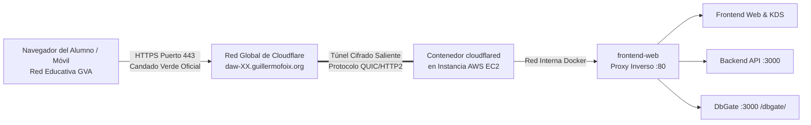

# Práctica 2: Conectividad Perimetral y Dominio Seguro con Cloudflare Zero Trust Tunnels

**Módulo:** Despliegue de Aplicaciones Web (2º DAW)  
**Ciclo Formativo:** Desarrollo de Aplicaciones Web / Multiplataforma  
**Proyecto:** Pizzería Bella Napoli  
**Requisito previo:** Haber completado la [Práctica 1: Despliegue en AWS EC2](P01_Despliegue_AWS.md) y conocer el [Flujo de Trabajo (WORKFLOW.md)](WORKFLOW.md).

---

## 1. Contexto y Arquitectura: De IPs Efímeras a Zero Trust

En entornos de nube pública para formación (como **AWS Academy Learner Lab**), los servidores no disponen de direcciones IP estáticas fijas. Cada vez que inicias o detienes tu máquina virtual EC2 (`Stop` / `Start`), **AWS le asigna una dirección IP pública IPv4 completamente distinta**.

En el modelo tradicional de despliegue, esto obligaba a configurar clientes de DNS dinámico (DDNS) y scripts locales que frecuentemente eran bloqueados por los cortafuegos perimetrales de los centros educativos.

### La Solución de la Industria: Cloudflare Zero Trust Tunnels

Para garantizar un entorno de producción profesional, resiliente y accesible desde cualquier red educativa (LliureX / Windows), implementamos **Cloudflare Tunnels**:



### Ventajas de esta Arquitectura:
1. **Independencia absoluta de la IP:** No importa qué IP asigne AWS; el contenedor del túnel inicia la conexión desde dentro de la máquina hacia Cloudflare.
2. **Cero puertos abiertos al exterior:** Tu base de datos y tus servicios web no necesitan exponer puertos de entrada vulnerables en el Grupo de Seguridad de AWS.
3. **Cifrado HTTPS oficial automático:** Cloudflare gestiona y renueva el certificado SSL/TLS con candado verde sin necesidad de instalar ni configurar clientes de renovación locales.
4. **Compatibilidad total con el cortafuegos del instituto:** El tráfico viaja como HTTPS estándar (puerto 443) sobre un dominio institucional limpio (`guillermofoix.org`), sin bloqueos de filtros de centro.

---

## Requisitos Previos

Antes de comenzar, debes disponer de:
1. Tu máquina EC2 de AWS en ejecución (completada en la [Práctica 1](P01_Despliegue_AWS.md)).
2. Tu **Subdominio** y tu **Token de Túnel** asignados por el profesor a través de **Aules** (por ejemplo, `daw-01` con su URL `https://daw-01.guillermofoix.org` y su token alfanumérico).

---

## FASE 1: Conexión y Configuración del Token en AWS EC2

Conéctate a tu servidor Ubuntu en AWS mediante **EC2 Instance Connect** (o SSH desde tu terminal).

### 1. Situarse en el directorio del proyecto
```bash
cd ~/pizzeria-base
```

### 2. Actualizar el repositorio con los últimos cambios
Descarga las últimas mejoras de la arquitectura desde GitHub:
```bash
git pull origin main
```

### 3. Configurar el Token en el archivo de entorno `.env`
Abre el archivo de configuración `.env` con el editor nano:
```bash
nano .env
```

Localiza la variable `CLOUDFLARE_TUNNEL_TOKEN=` y pega el token que te ha proporcionado el profesor en Aules:
```env
# 2. CONECTIVIDAD CLOUDFLARE ZERO TRUST (TUNNEL)
CLOUDFLARE_TUNNEL_TOKEN=eyJhIjoiMzJmZGQ0ZWYwMzg4NjA4NTA5ZmY2ZTliMjYw...
```

> 💡 **Consejo de pegado en terminal:** En la consola web de AWS, usa `Ctrl + V` o haz clic derecho con el ratón para pegar. Verifica que no queden espacios en blanco al inicio o al final del token.

Guarda los cambios y sal del editor:
* Pulsa `Ctrl + O` y presiona `Enter` para confirmar.
* Pulsa `Ctrl + X` para salir.

---

## FASE 2: Despliegue y Puesta en Marcha del Túnel

Con el token configurado, orquestamos la nueva infraestructura en segundo plano:

### 1. Reconstruir y levantar los contenedores
Ejecuta el comando oficial de producción:
```bash
docker compose -f docker-compose.prod.yml up -d --build
```

### 2. Verificar el estado de los servicios
Comprueba que los 6 contenedores del stack estén en estado **Up**:
```bash
docker compose -f docker-compose.prod.yml ps
```

Deberás ver activos:
* `pizzeria-prod-db` (PostgreSQL 16)
* `pizzeria-prod-backend` (API REST Node.js)
* `pizzeria-prod-web` (Nginx Proxy y Frontend)
* `pizzeria-prod-qr` (App móvil para mesas)
* `pizzeria-prod-dbgate` (Gestor de base de datos)
* `pizzeria-prod-tunnel` (Conector Cloudflare Tunnel)

### 3. Inspeccionar la conexión del túnel
Revisa los registros de `cloudflared` para confirmar que el túnel se ha enlazado con éxito a la red de Cloudflare:
```bash
docker compose -f docker-compose.prod.yml logs tunnel
```

Deberás observar mensajes informativos confirmando la apertura de **4 conexiones redundantes** hacia los centros de datos más cercanos (Madrid / Valencia):
```text
INF Registered tunnel connection connIndex=0 connection=... location=MAD
INF Registered tunnel connection connIndex=1 connection=... location=MAD
INF Registered tunnel connection connIndex=2 connection=... location=VLC
INF Registered tunnel connection connIndex=3 connection=... location=VLC
```

---

## FASE 3: Verificación Integral de Servicios y Acceso HTTPS

Abre el navegador web en el ordenador del instituto (o en tu móvil/portátil) y accede a tu subdominio asignado sustituyendo `XX` por tu número de alumno:

| Servicio | URL Pública Segura | Resultado Esperado |
| :--- | :--- | :--- |
| **Portal Web & Cocina KDS** | `https://daw-XX.guillermofoix.org` | Interfaz interactiva de la pizzería con carta y pedidos (Candado verde). |
| **Diagnóstico API Backend** | `https://daw-XX.guillermofoix.org/api/health` | JSON: `{"status":"UP","database":{"connected":true}}`. |
| **WebApp Móvil Clientes** | `https://daw-XX.guillermofoix.org/app/` | Aplicación PWA para clientes y comensales. |
| **Gestión BBDD (DbGate)** | `https://daw-XX.guillermofoix.org/dbgate/` | Entorno DbGate con la base de datos `pizzeria_db` lista para consultar. |

### Prueba en el Gestor de Base de Datos (DbGate):
1. Entra a `https://daw-XX.guillermofoix.org/dbgate/`.
2. En el panel izquierdo verás la conexión preconfigurada **Pizzería DB**.
3. Haz clic en **Tables** → selecciona la tabla `pizzas` → haz clic derecho y pulsa **Data**.
4. Podrás visualizar en tiempo real los registros de la pizzería y ejecutar consultas SQL directamente desde el navegador, sin instalar ningún software en tu ordenador.

---

## FASE 4: Prueba de Resiliencia ante Reinicios de AWS

Para comprobar que el sistema es totalmente autónomo y no depende de la IP de Amazon:

1. Ve a la consola de AWS EC2.
2. Selecciona tu instancia → **Estado de la instancia** → **Reiniciar instancia** (o *Detener* y volver a *Iniciar*).
3. Espera 1 minuto a que el estado vuelva a ser *En ejecución*.
4. Observa que Amazon le ha asignado una **dirección IP pública totalmente diferente**.
5. **No toques nada en la máquina.** Simplemente refresca en tu navegador:
   `https://daw-XX.guillermofoix.org`
6. **Resultado:** La web vuelve a responder de forma inmediata y automática con el mismo dominio y con HTTPS seguro.

---

## FASE 5: Procedimiento de Cierre y Ahorro de Créditos

El Learner Lab detiene automáticamente las instancias tras **4 horas** de sesión, pero para ahorrar créditos al finalizar tu trabajo:

1. Detén los contenedores desde la terminal:
   ```bash
   docker compose -f docker-compose.prod.yml stop
   ```
2. En la consola de AWS: Selecciona la instancia → **Estado de la instancia** → **Detener instancia** (_Stop instance_).
3. Cierra el navegador. Recuerda: **NUNCA pulses "End Lab"** en Vocareum para no destruir tus recursos.

---

## SIGUIENTE PASO: Securización Perimetral y Auditoría Web
👉 **[Práctica 3: Securización Perimetral y Auditoría de Seguridad Web](P03_Securizacion_HTTPS_Hardening.md)**
