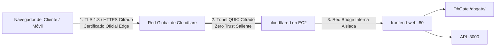

# Práctica 3: Securización Perimetral, Cifrado HTTPS y Hardening Web

**Módulo:** Despliegue de Aplicaciones Web (2º DAW)  
**Ciclo Formativo:** Desarrollo de Aplicaciones Web  
**Proyecto:** Pizzería Bella Napoli  
**Requisitos previos:**  
- [Práctica 1: Despliegue en AWS EC2](P01_Despliegue_AWS.md)
- [Práctica 2: Conectividad y Túneles Zero Trust](P02_Conectividad_Cloudflare_Tunnels.md)
- [Metodología de Trabajo (WORKFLOW.md)](WORKFLOW.md)

---

## 1. Contexto: De la Red Abierta al Perímetro Cifrado

Hasta el despliegue de la infraestructura segura, el tráfico web tradicional en Internet viajaba en texto plano (HTTP / puerto 80). En cualquier aplicación real que gestione usuarios, pedidos o datos transaccionales, **HTTPS no es una opción, es un estándar ineludible**:

1. **Cifrado en tránsito:** Impide que atacantes en la misma red local (por ejemplo, en una WiFi pública o en la red del instituto) puedan espiar credenciales, pedidos o consultas SQL mediante ataques *Man-in-the-Middle* (MitM).
2. **Integridad de datos:** Garantiza que el contenido enviado por el servidor no ha sido manipulado ni alterado en tránsito por intermediarios.
3. **Requisito para APIs Web Modernas:** Los navegadores modernos bloquean el acceso a la cámara (escaneo QR de mesas), geolocalización y la instalación de **Progressive Web Apps (PWA)** mediante *Service Workers* si el contexto no es estrictamente HTTPS.

### Arquitectura Edge SSL y Túneles Cifrados

En nuestra arquitectura, el cifrado perimetral opera mediante un modelo de **doble capa segura**:



1. **Capa 1 (Edge SSL):** El cliente se conecta con la red perimetral de Cloudflare usando protocolos criptográficos de última generación (**TLS 1.3** y **TLS 1.2**).
2. **Capa 2 (Túnel Zero Trust):** Los paquetes viajan a través de un túnel cifrado de extremo a extremo mediante el protocolo seguro **QUIC / HTTP/2**, sin que la máquina de AWS tenga que abrir ningún puerto al exterior.

---

## FASE 1: Auditoría del Certificado Digital en el Navegador

Cada alumno dispone de un certificado SSL/TLS oficial emitido para su subdominio (`https://daw-XX.guillermofoix.org`). En esta fase analizaremos sus parámetros criptográficos.

1. Abre tu navegador web (Google Chrome, Firefox o Edge) e introduce la URL de tu pizzería:
   ```text
   https://daw-XX.guillermofoix.org
   ```
2. Haz clic sobre el **icono del candado** situado a la izquierda de la barra de direcciones.
3. Selecciona **La conexión es segura** → **El certificado es válido** (o *Ver certificado*).
4. **Analiza los campos del certificado digital:**
   * **Nombre común (CN):** Observa que cubre tu dominio (`guillermofoix.org` o `*.guillermofoix.org`).
   * **Autoridad emisora (CA):** Comprueba que ha sido emitido por una entidad de certificación de primer nivel (como *Google Trust Services* o *Let's Encrypt*).
   * **Algoritmo de firma:** Verifica el uso de algoritmos robustos (ejemplo: `SHA-256 con cifrado RSA` o `ECDSA`).
   * **Periodo de validez:** Comprueba las fechas de emisión y expiración.

---

## FASE 2: Inspección de Cabeceras de Seguridad HTTP (Security Headers)

Un servidor web seguro no solo debe cifrar el tráfico, sino que debe enviar directivas explícitas al navegador para defenderse contra ataques de inyección, *Clickjacking* y *MIME-Sniffing*.

En nuestro archivo `frontend-web/nginx.conf` hemos implementado cabeceras de seguridad perimetral:

```nginx
add_header X-Content-Type-Options nosniff;
add_header Referrer-Policy "strict-origin-when-cross-origin";
```

### Comprobación mediante terminal con `curl`:
Desde la terminal de tu máquina EC2 (o desde tu ordenador local), ejecuta una petición HTTP de solo cabeceras (`-I`):

```bash
curl -I https://daw-XX.guillermofoix.org/
```

#### Salida esperada en la respuesta:
```text
HTTP/2 200 
date: Sun, 20 Sep 2026 18:00:00 GMT
content-type: text/html
x-content-type-options: nosniff
referrer-policy: strict-origin-when-cross-origin
server: cloudflare
...
```

* **`X-Content-Type-Options: nosniff`:** Evita que el navegador intente adivinar el tipo de contenido de un archivo, bloqueando ataques de ejecución de scripts maliciosos camuflados como imágenes.
* **`Referrer-Policy: strict-origin-when-cross-origin`:** Protege la privacidad del usuario limitando la información sensible enviada en las cabeceras `Referer` al navegar hacia sitios externos.

---

## FASE 3: Validación del Contexto Seguro para la PWA Móvil

El frontend móvil de clientes (`frontend-qr-app`) está desarrollado como una **Progressive Web App (PWA)** y utiliza un archivo *Service Worker* (`sw.js`).

1. Accede desde tu móvil o desde el navegador de clase a:
   ```text
   https://daw-XX.guillermofoix.org/app/
   ```
2. Abre las **Herramientas de Desarrollador** del navegador (`F12` o `Ctrl + Shift + I`).
3. Ve a la pestaña **Application** (o *Almacenamiento*) → **Service Workers**.
4. **Verificación:** Comprueba que el Service Worker se encuentra en estado **Activated and is running** (icono verde).
   > ⚠️ **Nota didáctica:** Si intentaras acceder a esta misma aplicación a través de HTTP plano (`http://...`), los navegadores modernos **desactivan y bloquean automáticamente el Service Worker**, impidiendo que la app funcione offline o se instale en el teléfono.

---

## FASE 4: Auditoría de Hardening Perimetral (Escaneo de Puertos)

La mayor ventaja de la arquitectura Zero Trust implementada en la Práctica 2 es la **reducción radical de la superficie de ataque**.

Para demostrarlo empíricamente:

1. Obtén la IP pública de tu servidor AWS:
   ```bash
   curl -s ifconfig.me
   ```
2. Desde otra máquina (o usando herramientas en línea o `nmap`), realiza un escaneo de los puertos habituales sobre tu IP pública:
   ```bash
   nmap -Pn -p 22,80,443,3000,5432 TU_IP_PUBLICA
   ```

#### Resultado de la auditoría:
* **Puerto 22 (SSH):** Abierto para gestión por terminal remota.
* **Puerto 80 (HTTP):** Abierto solo si decidiste exponerlo en tu Security Group para pruebas iniciales.
* **Puertos 3000 (Node.js API) y 5432 (PostgreSQL):** **CERRADOS / FILTRADOS**.

**Conclusión de seguridad:** La base de datos relacional y el backend de la pizzería son completamente invisibles e inalcanzables desde Internet. La única vía de acceso es a través del túnel autenticado por Cloudflare bajo la URL protegida `https://daw-XX.guillermofoix.org/dbgate/`.

---

## Matriz Resumen de Servicios Seguros

| Servicio | URL Pública Segura | Protocolo | Estado de Seguridad |
| :--- | :--- | :---: | :--- |
| **Portal Web & KDS** | `https://daw-XX.guillermofoix.org` | HTTPS / TLS 1.3 | ✅ Conexión segura oficial (TLS 1.3). |
| **API REST Backend** | `https://daw-XX.guillermofoix.org/api/health` | HTTPS / TLS 1.3 | ✅ Conexión segura con la BBDD. |
| **WebApp Móvil Clientes** | `https://daw-XX.guillermofoix.org/app/` | HTTPS / TLS 1.3 | ✅ Service Worker activo y PWA instalable. |
| **Gestión BBDD (DbGate)** | `https://daw-XX.guillermofoix.org/dbgate/` | HTTPS + WSS | ✅ WebSockets cifrados, BBDD aislada. |

---

## FASE 5: Procedimiento de Cierre y Ahorro de Saldo

El Learner Lab detiene automáticamente las instancias tras **4 horas** de sesión, pero para ahorrar créditos al finalizar tu práctica:

1. Detén los contenedores desde la terminal:
   ```bash
   docker compose -f docker-compose.prod.yml stop
   ```
2. En la consola de AWS: Selecciona la instancia → **Estado de la instancia** → **Detener instancia** (_Stop instance_).
3. Cierra el navegador. Recuerda: **NUNCA pulses "End Lab"** en el panel de Vocareum si deseas conservar tu trabajo para futuras sesiones.

---

## SIGUIENTE PASO: Desacople de Arquitectura y Redes Multi-Stack
👉 **[Práctica 4: Desacople de Arquitectura y Redes Multi-Stack en Docker](P04_Desacople_BD.md)**
