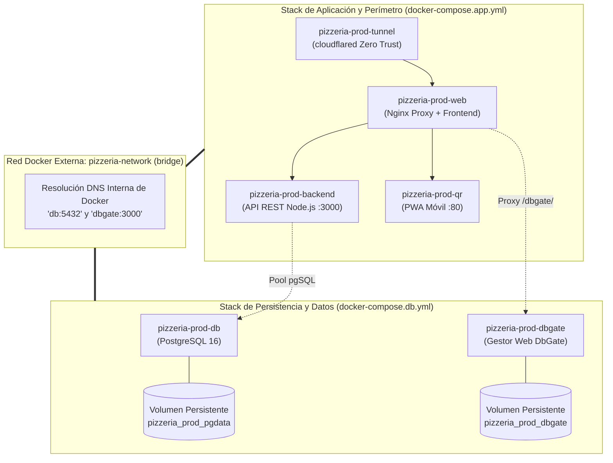

# Práctica 4: Desacople de Arquitectura y Redes Multi-Stack en Docker

**Módulo:** Despliegue de Aplicaciones Web (2º DAW)  
**Ciclo Formativo:** Desarrollo de Aplicaciones Web / Multiplataforma  
**Proyecto:** Pizzería Bella Napoli  
**Requisitos previos:**  
- [Práctica 1: Despliegue en AWS EC2](P01_Despliegue_AWS.md)
- [Práctica 2: Conectividad y Túneles Zero Trust](P02_Conectividad_Cloudflare_Tunnels.md)
- [Práctica 3: Securización Perimetral y Auditoría Web](P03_Securizacion_HTTPS_Hardening.md)
- [Metodología de Trabajo (WORKFLOW.md)](WORKFLOW.md)

---

## 1. Contexto y Arquitectura: Del Monolito al Desacople de Capas

Hasta ahora, en las Prácticas 1 y 2, hemos utilizado un único archivo orquestador (`docker-compose.prod.yml`) que levantaba los 6 contenedores a la vez. Aunque este enfoque es excelente para arrancar rápidamente en entornos de desarrollo, **en entornos de producción reales representa un antipatrón de diseño**:

> ⚠️ **El problema del orquestador monolítico:**  
> Cada vez que los desarrolladores compilan o actualizan el Frontend o la API REST (`docker compose down && up`), **la base de datos se detiene y se destruye**. Esto provoca cortes de servicio innecesarios para los clientes y riesgos graves de corrupción en escrituras activas.

### La Solución Profesional: Separación de Ciclos de Vida

En esta práctica dividimos la arquitectura en **dos stacks independientes** que se comunican a través de una **red virtual externa compartida (`pizzeria-network`)**:



### Ventajas de la Arquitectura Desacoplada:
1. **Independencia absoluta de despliegue:** Puedes recompilar y reiniciar el frontend o el backend 20 veces al día sin reiniciar jamás PostgreSQL.
2. **Aislamiento y resiliencia:** Un fallo de memoria o una fuga en la aplicación nunca tumbará el servicio de datos.
3. **Preparación Cloud Native:** Facilita migrar en el futuro el contenedor `db` hacia una base de datos gestionada (como AWS RDS) cambiando una sola variable en el backend, sin modificar la infraestructura web.

---

## FASE 1: Detención Ordenada del Stack Monolítico

Conéctate a tu máquina en AWS mediante **EC2 Instance Connect** (o SSH) y sitúate en la raíz del proyecto:

```bash
cd ~/pizzeria-base
```

Descarga la última versión del repositorio con los nuevos archivos de orquestación desacoplados:

```bash
git pull origin main
```

Detén y retira los contenedores monolíticos anteriores. **IMPORTANTE:** No utilices la opción `-v` (volúmenes) para no perder los datos registrados en tu base de datos:

```bash
docker compose -f docker-compose.prod.yml down
```

Comprueba que no quede ningún contenedor de la pizzería activo:

```bash
docker ps
```
*(Deberás ver únicamente la cabecera vacía).*

---

## FASE 2: Creación de la Red Docker Externa Compartida

En Docker Compose, cuando un archivo declara una red con `external: true`, **Docker exige que la red haya sido creada previamente de forma manual**. Si omites este paso, Compose arrojará un error de red no encontrada.

### 1. Crear la red compartida
Ejecuta en la terminal:

```bash
docker network create pizzeria-network
```

### 2. Verificar la red
Comprueba que la red existe y utiliza el controlador de puente (*bridge*):

```bash
docker network ls
```

Deberás ver listada tu red:
```text
NETWORK ID     NAME               DRIVER    SCOPE
...            pizzeria-network   bridge    local
```

---

## FASE 3: Despliegue de la Capa de Datos y Persistencia

Ahora arrancamos **única y exclusivamente la base de datos PostgreSQL y su gestor visual DbGate**.

### 1. Levantar el stack de datos
```bash
docker compose -f docker-compose.db.yml up -d
```

### 2. Verificar el estado de salud (*Healthcheck*)
PostgreSQL dispone de un mecanismo de comprobación periódica (`pg_isready`). Espera 10 segundos y comprueba el estado:

```bash
docker compose -f docker-compose.db.yml ps
```

**Salida esperada:**
```text
NAME                   IMAGE                    COMMAND                  SERVICE   STATUS                    PORTS
pizzeria-prod-db       postgres:16-alpine       "docker-entrypoint.s…"   db        Up (healthy)              5432/tcp
pizzeria-prod-dbgate   dbgate/dbgate:latest     "/docker-entrypoint.…"   dbgate    Up                        3000/tcp
```

> ℹ️ **Observación de seguridad perimetral:**  
> Fíjate en la columna `PORTS`: Ambos puertos (`5432/tcp` y `3000/tcp`) están activos **únicamente dentro de la red interna de Docker**. No tienen ningún mapeo hacia el exterior (`0.0.0.0:...`), por lo que nadie desde fuera puede atacarlos.

---

## FASE 4: Despliegue de la Capa de Aplicación y Perímetro

Con la capa de datos saludable y disponible en la red `pizzeria-network`, orquestamos el stack con la API Node.js, Nginx, la PWA y el túnel de Cloudflare.

### 1. Levantar y compilar la aplicación
```bash
docker compose -f docker-compose.app.yml up -d --build
```

### 2. Verificar el estado global del sistema
Revisa los contenedores de la aplicación:

```bash
docker compose -f docker-compose.app.yml ps
```

Deberás observar los 4 contenedores de la capa lógica en estado **Up**:
* `pizzeria-prod-backend` (Node.js Express)
* `pizzeria-prod-web` (Nginx Proxy Inverso)
* `pizzeria-prod-qr` (App móvil PWA)
* `pizzeria-prod-tunnel` (Cloudflare Tunnel)

### 3. Inspeccionar el túnel de Cloudflare
Confirma que el túnel ha enganchado de nuevo con la red global:

```bash
docker compose -f docker-compose.app.yml logs --tail 15 tunnel
```

Deberás ver los registros confirmando las 4 conexiones redundantes (`INF Registered tunnel connection ...`).

---

## FASE 5: Demostración de Resiliencia y Desacople en Caliente

Para experimentar el verdadero valor de esta arquitectura profesional, realizaremos una prueba de simulación de caída y actualización de código:

### 1. Crear un pedido o consultar la BBDD
Abre tu navegador y entra a tu URL:  
👉 **`https://daw-XX.guillermofoix.org`** (o `https://profe01...`)

Realiza un pedido o consulta la tabla `pizzas` desde DbGate (`/dbgate/`).

### 2. Simular una actualización / caída completa de la aplicación
En tu terminal de AWS, destruye por completo el stack de la aplicación web:

```bash
docker compose -f docker-compose.app.yml down
```

### 3. Comprobar que la base de datos permanece intacta
Ejecuta:

```bash
docker compose -f docker-compose.db.yml ps
```

**Resultado:** `pizzeria-prod-db` sigue en ejecución (`Up healthy`) sin haberse enterado de que la web se ha caído.

### 4. Volver a levantar la aplicación
Vuelve a iniciar el stack de aplicación:

```bash
docker compose -f docker-compose.app.yml up -d
```

Refresca el navegador web (`F5`). La aplicación volverá a responder de inmediato con todos tus datos y pedidos intactos.

---

## FASE 6: Verificación Integral de Servicios

Comprueba que todas las rutas públicas siguen respondiendo con su certificado HTTPS oficial a través del túnel:

| Servicio | URL Pública Segura | Resultado Esperado |
| :--- | :--- | :--- |
| **Portal Web & Cocina KDS** | `https://daw-XX.guillermofoix.org` | Interfaz comercial interactiva y pedidos de cocina. |
| **Diagnóstico API Backend** | `https://daw-XX.guillermofoix.org/api/health` | JSON: `{"status":"UP","database":{"connected":true}}`. |
| **WebApp Móvil Clientes** | `https://daw-XX.guillermofoix.org/app/` | Aplicación PWA para clientes y mesas QR. |
| **Gestión BBDD (DbGate)** | `https://daw-XX.guillermofoix.org/dbgate/` | Entorno DbGate listo para consultas SQL. |

---

## FASE 7: Procedimiento de Cierre y Ahorro de Créditos

Cuando finalices tu sesión de trabajo en AWS Academy:

1. **Detener ambos stacks de forma ordenada:**
   ```bash
   docker compose -f docker-compose.app.yml stop
   docker compose -f docker-compose.db.yml stop
   ```
2. En la consola de AWS EC2: Selecciona la instancia $\rightarrow$ **Estado de la instancia** $\rightarrow$ **Detener instancia** (*Stop instance*).
3. **Recordatorio crítico:** NUNCA pulses *"End Lab"* en Vocareum si deseas conservar tu máquina para la Práctica 5.

---

## SIGUIENTE PASO: Defensa en Profundidad y Hardening
👉 **[Práctica 5: Defensa en Profundidad, Hardening y Zero Trust](P05_Seguridad_Pizzeria.md)**
