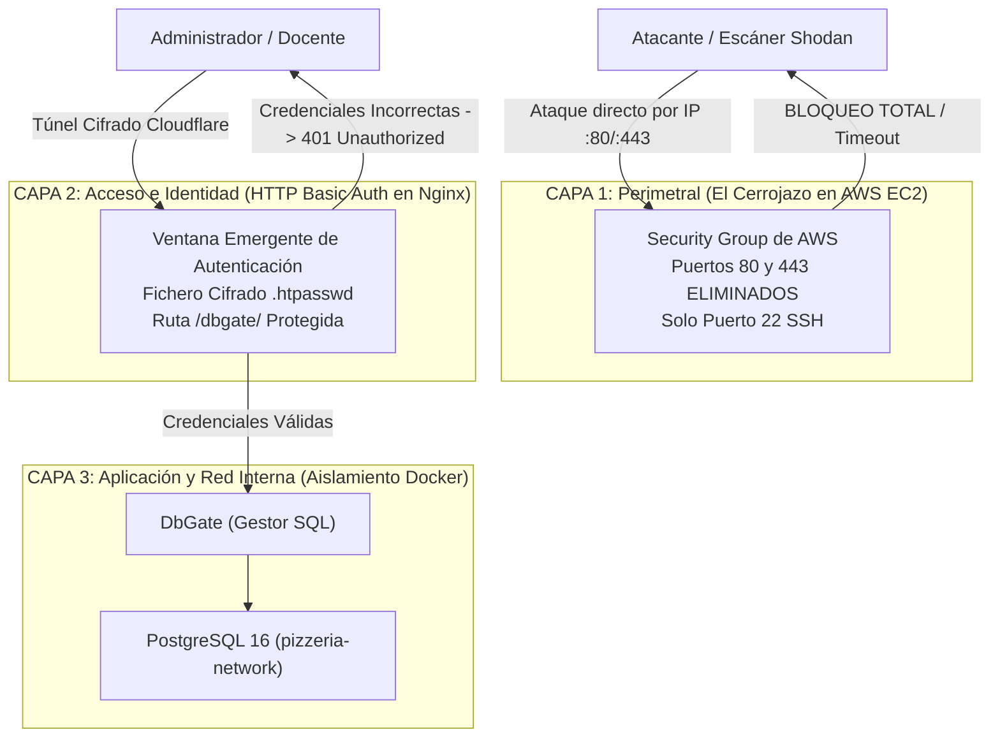

# Práctica 5: Defensa en Profundidad, Hardening Perimetral y Zero Trust

**Módulo:** Despliegue de Aplicaciones Web (2º DAW)  
**Ciclo Formativo:** Desarrollo de Aplicaciones Web / Multiplataforma  
**Proyecto:** Pizzería Bella Napoli  
**Requisitos previos:**  
- [Práctica 1: Despliegue en AWS EC2](P01_Despliegue_AWS.md)
- [Práctica 2: Conectividad y Túneles Zero Trust](P02_Conectividad_Cloudflare_Tunnels.md)
- [Práctica 3: Securización Perimetral y Auditoría Web](P03_Securizacion_HTTPS_Hardening.md)
- [Práctica 4: Desacople de Arquitectura en Docker](P04_Desacople_BD.md)
- [Flujo de Trabajo (WORKFLOW.md)](WORKFLOW.md)

---

## 1. Contexto: El Principio de Defensa en Profundidad

En la Práctica 2 y 3 logramos que nuestra aplicación fuera accesible a través de Internet con HTTPS mediante Cloudflare Tunnels. Sin embargo, si analizamos la arquitectura con ojos de auditor de seguridad, descubrimos **dos vulnerabilidades críticas**:

1. **Superficie de ataque residual en AWS:** En el Grupo de Seguridad de AWS dejamos abiertos los puertos **80 (HTTP)** y **443 (HTTPS)** a todo el mundo (`0.0.0.0/0`). Cualquier escáner automatizado (como Shodan o Censys) puede localizar la IP pública de nuestra máquina y atacarla directamente.
2. **Exposición pública del panel de administración (`/dbgate/`):** Cualquier usuario anónimo que conozca la URL pública puede acceder directamente a la base de datos PostgreSQL, ejecutar consultas SQL y alterar o eliminar registros sin que se le solicite ninguna credencial.

### El Modelo de Seguridad en 3 Capas Concéntricas

Para solventar estas debilidades implementaremos el estándar de la industria conocido como **Defensa en Profundidad** (*Defense in Depth*):



---

## FASE 1: Seguridad Perimetral ("El Cerrojazo en AWS EC2")

El túnel de Cloudflare (`cloudflared`) establece una **conexión cifrada saliente** desde el interior de AWS hacia la red perimetral de Cloudflare. **No requiere ningún puerto de entrada abierto en AWS**.

Vamos a demostrarlo empíricamente cerrando el cortafuegos de Amazon:

### 1. Modificar el Grupo de Seguridad en la consola de AWS
1. Entra en la consola de **AWS EC2**.
2. En el menú izquierdo, ve a **Red y seguridad** $\rightarrow$ **Grupos de seguridad** (*Security Groups*).
3. Selecciona tu grupo: **`pizzeria-secgroup`**.
4. Pulsa en la pestaña **Reglas de entrada** (*Inbound rules*) $\rightarrow$ **Editar reglas de entrada**.
5. **Elimina la regla HTTP (puerto 80)** y, si tuvieras la regla HTTPS (puerto 443), elimínala también.
6. **Deja ÚNICAMENTE la regla SSH (puerto 22)** para poder seguir conectándote por terminal.
7. Pulsa en **Guardar reglas**.

### 2. Prueba empírica de bloqueo por IP
Obtén la IP pública de tu máquina:

```bash
curl -s ifconfig.me
```

Abre una pestaña en tu navegador e intenta acceder directamente por IP:  
👉 **`http://<TU_IP_PUBLICA>`**

**Resultado esperado:** El navegador se queda cargando en bucle hasta que devuelve **`ERR_CONNECTION_TIMED_OUT`**. Tu servidor de AWS se ha vuelto completamente **invisible e inaccesible por IP directa**.

### 3. Prueba empírica de supervivencia por Túnel
Ahora entra en tu navegador a tu URL pública oficial con Cloudflare:  
👉 **`https://daw-XX.guillermofoix.org`** (o `https://profe01...`)

**Resultado esperado:** La web responde de forma inmediata con candado de seguridad HTTPS. El perímetro de AWS está 100% blindado y el tráfico legítimo fluye por el túnel cifrado.

---

## FASE 2: Capa de Control de Acceso (HTTP Basic Auth en Nginx)

Ahora protegeremos el endpoint de administración de base de datos (`/dbgate/`) para que nadie pueda ver el panel sin autenticarse primero con credenciales seguras.

### 1. Generar el archivo de contraseñas seguras (`.htpasswd`)
En Linux, el estándar para autenticación web básica es el archivo `.htpasswd` con contraseñas cifradas. 

Sitúate en la raíz del proyecto en tu máquina de AWS:

```bash
cd ~/pizzeria-base
```

Genera el archivo `.htpasswd` definiendo el usuario **`admin`** y una contraseña robusta utilizando la herramienta `openssl` (instalada de serie en Ubuntu):

```bash
# Sintaxis: echo "usuario:$(openssl passwd -apr1 'TU_PASSWORD_SEGURO')" > .htpasswd
echo "admin:$(openssl passwd -apr1 'PizzeriaAdmin_2026!')" > .htpasswd
```

Asigna permisos de solo lectura para mayor seguridad:

```bash
chmod 600 .htpasswd
```

*(Puedes comprobar que el archivo se ha creado correctamente y contiene el hash ejecutando `cat .htpasswd`).*

---

### 2. Montar el archivo en el contenedor Nginx
Para que Nginx pueda leer este archivo de claves, debemos montarlo en el servicio `frontend-web`.

Abre el archivo `docker-compose.app.yml` con `nano`:

```bash
nano docker-compose.app.yml
```

Localiza la sección del servicio `frontend-web` y añade la directiva `volumes` con el archivo `.htpasswd`:

```yaml
  # 2. Frontend Web Comercial, Cocina KDS y Proxy Inverso Nginx
  frontend-web:
    build:
      context: ./frontend-web
      dockerfile: Dockerfile
    container_name: pizzeria-prod-web
    restart: unless-stopped
    ports:
      - "${HTTP_PORT:-80}:80"
    volumes:
      - ./.htpasswd:/etc/nginx/.htpasswd:ro
    depends_on:
      - backend
    networks:
      - pizzeria-network
```

*(Guarda con `Ctrl+O` y sal con `Ctrl+X`).*

---

### 3. Configurar la protección en `frontend-web/nginx.conf`
Abre el archivo de configuración de Nginx:

```bash
nano frontend-web/nginx.conf
```

Localiza el bloque de DbGate (`location /dbgate/`) y añade las dos directivas de autenticación (`auth_basic` y `auth_basic_user_file`):

```nginx
    # 5. Reverse Proxy hacia DbGate (Protegido con Autenticación Básica)
    location /dbgate/ {
        auth_basic "Zona Restringida - Administracion Pizzeria";
        auth_basic_user_file /etc/nginx/.htpasswd;

        proxy_pass http://dbgate:3000;
        proxy_http_version 1.1;
        proxy_set_header Upgrade $http_upgrade;
        proxy_set_header Connection $connection_upgrade;
        proxy_set_header Host $host;
        proxy_set_header X-Real-IP $remote_addr;
        proxy_set_header X-Forwarded-For $proxy_add_x_forwarded_for;
        proxy_set_header X-Forwarded-Proto $scheme;
        proxy_buffering off;
        proxy_cache off;
        proxy_read_timeout 86400s;
    }
```

*(Guarda los cambios con `Ctrl+O` y sal con `Ctrl+X`).*

---

### 4. Aplicar los cambios y recompilar Nginx
Reconstruye y reinicia el stack de aplicación para cargar la nueva configuración:

```bash
docker compose -f docker-compose.app.yml up -d --build frontend-web
```

---

## FASE 3: Verificación y Auditoría de la Autenticación

Vamos a comprobar que la protección funciona tanto desde el navegador como mediante auditoría con terminal:

### 1. Prueba en el Navegador
Abre una ventana en modo incógnito (o refresca con `Ctrl + F5`) y accede a:  
👉 **`https://daw-XX.guillermofoix.org/dbgate/`**

1. El navegador mostrará inmediatamente una **ventana emergente de inicio de sesión del sistema** solicitando usuario y contraseña:
   * **Nombre de usuario:** `admin`
   * **Contraseña:** `PizzeriaAdmin_2026!`
2. Si introduces una contraseña errónea o cancelas el diálogo, el servidor devolverá un código de error **`401 Authorization Required`**.
3. Al introducir las credenciales correctas, DbGate cargará con normalidad.

### 2. Auditoría por Terminal con `curl`
Desde la terminal, comprueba cómo responde Nginx cuando no se envían credenciales:

```bash
curl -sI https://daw-XX.guillermofoix.org/dbgate/ | grep -E "HTTP|WWW-Authenticate"
```

**Salida esperada (Acceso denegado con desafío de cabecera):**
```text
HTTP/2 401 
www-authenticate: Basic realm="Zona Restringida - Administracion Pizzeria"
```

Ahora comprueba que con credenciales válidas el acceso es concedido:

```bash
curl -sI -u admin:PizzeriaAdmin_2026! https://daw-XX.guillermofoix.org/dbgate/ | grep "HTTP"
```

**Salida esperada:**
```text
HTTP/2 200 
```

---

## FASE 4: Capa de Aplicación: Hardening del Contenedor DbGate

Como última capa de seguridad dentro de la red interna, eliminaremos el parámetro `SKIP_ALL_AUTH=true` en el archivo de base de datos para asegurar que DbGate no omita ninguna comprobación de permisos.

1. Abre `docker-compose.db.yml`:
   ```bash
   nano docker-compose.db.yml
   ```
2. En la sección del servicio `dbgate`, cambia `SKIP_ALL_AUTH=true` por:
   ```yaml
   - SKIP_ALL_AUTH=false
   ```
3. Reinicia el contenedor de DbGate:
   ```bash
   docker compose -f docker-compose.db.yml up -d dbgate
   ```

---

## Matriz Resumen de Seguridad en 3 Capas

| Capa | Nivel de Seguridad | Mecanismo Implementado | Amenaza Mitigada |
| :--- | :--- | :--- | :--- |
| **Capa 1: Perimetral** | Red AWS EC2 | Eliminación de puertos 80/443 en Security Group. | Ataques DDoS directos, escáneres de puertos por IP (Shodan). |
| **Capa 2: Identidad** | Servidor Web Nginx | HTTP Basic Auth (`.htpasswd` con hash seguro). | Acceso público no autorizado y bots al panel `/dbgate/`. |
| **Capa 3: Aplicación** | Datos y DbGate | Aislamiento en `pizzeria-network` y `SKIP_ALL_AUTH=false`. | Consultas SQL maliciosas y modificación accidental de datos. |

---

## FASE 5: Procedimiento de Cierre y Ahorro de Créditos

Cuando finalices tu sesión de trabajo en AWS Academy:

1. **Detener ambos stacks de forma ordenada:**
   ```bash
   docker compose -f docker-compose.app.yml stop
   docker compose -f docker-compose.db.yml stop
   ```
2. En la consola de AWS EC2: Selecciona la instancia $\rightarrow$ **Estado de la instancia** $\rightarrow$ **Detener instancia** (*Stop instance*).
3. Recuerda: **NUNCA pulses "End Lab"** en el panel de Vocareum.

---

## ¡ENHORABUENA! ARQUITECTURA COMPLETADA
Has transformado un despliegue monolítico tradicional en una **arquitectura cloud desacoplada, resiliente y protegida bajo el paradigma Zero Trust y Defensa en Profundidad**.
