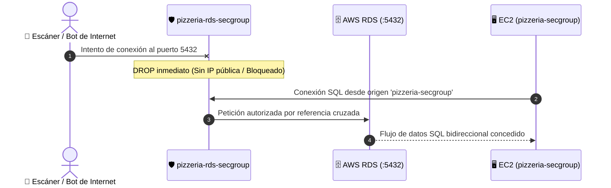

# PRÁCTICA 06: MIGRACIÓN A BASE DE DATOS CLOUD GESTIONADA (AWS RDS)

## Arquitectura Three-Tier: Del Despliegue Self-Hosted a la Persistencia Cloud-Native

---

## 🎯 Objetivos de Aprendizaje
* **Comprender la Arquitectura de 3 Capas (Three-Tier):** Separar físicamente la capa de cómputo (servidores de aplicación) de la capa de persistencia gestionada (base de datos relacional).
* **Aprovisionamiento Cloud-Native:** Desplegar una instancia gestionada de **Amazon RDS (PostgreSQL 16)** bajo parámetros de seguridad y control de costes (*FinOps*).
* **Seguridad por Referencia Cruzada (Security Groups):** Implementar aislamiento de red sin exponer la base de datos a Internet (`Publicly Accessible = No`), autorizando el acceso exclusivamente desde el Security Group de la máquina EC2.
* **El Servidor Bastión Web:** Utilizar el gestor visual **DbGate** y el túnel perimetral **Cloudflare Zero Trust** como puente administrativo seguro hacia la VPC privada de AWS.
* **Migración "Zero Code":** Conmutar la conexión del backend Node.js desde el contenedor Docker local hacia AWS RDS mediante variables de entorno en el archivo `.env`, sin modificar ni una sola línea de código fuente.

---

## 🏗️ Diagrama de Arquitectura de la Práctica

```mermaid
flowchart TD
    subgraph Internet ["🌐 Internet (Clientes y Alumnos)"]
        User["💻 Navegador Web / Móvil"]
    end

    subgraph CloudflareEdge ["🛡️ Cloudflare Zero Trust Edge"]
        CF["Cloudflare Tunnel (*.guillermofoix.org)"]
    end

    subgraph AWS_VPC ["☁️ Amazon Web Services - VPC Privada"]
        subgraph EC2_Tier ["Instancia EC2 (pizzeria-secgroup)"]
            TunnelClient["cloudflared (Conexión Saliente)"]
            Nginx["Nginx Reverse Proxy (:80)"]
            Backend["Backend API REST (Node.js :3000)"]
            DbGate["DbGate Web (Gestor SQL :3000)"]
            OldDB["(APAGADO) Postgres Docker Local"]
        end

        subgraph RDS_Tier ["Capa de Datos Gestionada (pizzeria-rds-secgroup)"]
            RDS[("🗄️ AWS RDS PostgreSQL 16\n(db.t4g.micro / 20 GB gp3)\n[Publicly Accessible: NO]")]
        end
    end

    User -->|HTTPS| CF
    CF -->|Túnel Seguro Saliente| TunnelClient
    TunnelClient --> Nginx
    Nginx -->|/api/| Backend
    Nginx -->|/dbgate/ (HTTP Basic Auth)| DbGate

    Backend -.->|ANTES: Red Docker interna| OldDB
    Backend ==>|AHORA: Puerto 5432 (VPC Interna)| RDS
    DbGate ==>|Gestión SQL: Puerto 5432| RDS

    classDef aws fill:#FF9900,stroke:#232F3E,stroke-width:2px,color:#fff;
    classDef cf fill:#F38020,stroke:#FAAD3F,stroke-width:2px,color:#fff;
    classDef docker fill:#2496ED,stroke:#1D63ED,stroke-width:2px,color:#fff;
    class RDS aws;
    class CF cf;
    class Backend,Nginx,DbGate docker;
```

---

## 1. Introducción: Del Self-Hosted al Cloud-Native

En las prácticas anteriores (**P01 a P05**), ejecutamos la base de datos dentro de un contenedor Docker en la misma máquina virtual EC2 (*Self-Hosted*). Aunque el desacople de la **P04** independizó los ciclos de vida de Docker, ambos componentes seguían compartiendo la misma CPU, memoria RAM y disco físico de la máquina virtual.

En entornos empresariales de producción, esta arquitectura monolítica presenta graves riesgos:
1. **Punto Único de Fallo (SPOF):** Si la máquina EC2 se bloquea por saturación de tráfico web, la base de datos se interrumpe y los pedidos se detienen.
2. **Operaciones Manuales:** Las copias de seguridad (*backups*), rotación de discos, replicación y parches del sistema operativo recaen enteramente sobre el equipo técnico.

### La Solución Cloud: Amazon RDS
**AWS RDS (Relational Database Service)** es un servicio de base de datos administrado que asume toda la carga operativa: aprovisionamiento de hardware, parches de seguridad del motor, copias de seguridad continuas y almacenamiento redundante.

### El Concepto de "Servidor Bastión Web"
Para garantizar la máxima seguridad, nuestra instancia RDS se creará **sin IP pública** (`Publicly Accessible = No`). Nadie en Internet podrá atacarla ni escanearla.

**¿Cómo accederemos entonces a la base de datos para administrarla?**  
Nuestra máquina **EC2 actuará como "Bastión"**: como está dentro de la misma red de AWS y tiene acceso autorizado a RDS, accederemos a **DbGate** a través de nuestro túnel perimetral seguro de Cloudflare (`/dbgate/`). DbGate se encargará de hacer de puente entre nuestro navegador y el cluster privado de Amazon.

---

## FASE 1: Aprovisionamiento de AWS RDS (PostgreSQL 16)

> [!IMPORTANT]
> **Tiempo estimado de creación:** AWS tarda entre **5 y 7 minutos** en aprovisionar la máquina, formatear el disco EBS y arrancar PostgreSQL. Sigue con atención los pasos y, mientras se crea, pasa a la **Fase 2**.

### 1. Iniciar el Asistente de Creación en AWS
1. Inicia sesión en la consola de **AWS Academy**.
2. En la barra superior de búsqueda, escribe **RDS** y entra en el servicio.
3. En la pantalla inicial de bienvenida de *Aurora and RDS*:
   > [!WARNING]
   > **Cuidado con la pantalla de bienvenida:** Verás dos tarjetas:
   > * **Izquierda ("Cree con la configuración exprés"):** ❌ **NO pulses el botón naranja con el cohete**. Crea Aurora Serverless que no entra en la capa gratuita y agota créditos rápidamente.
   > * **Derecha ("Crear con configuración completa"):** ✅ **Haz clic en el botón blanco con borde azul `Crear`** (o entra en el menú izquierdo en *Bases de datos* $\rightarrow$ *Crear base de datos*).

---

### 2. Parámetros del Motor y Plantilla
* **Tipo de motor:** Haz clic sobre la tarjeta de **PostgreSQL** (el elefante azul).
* **Elegir un método de creación de base de datos:** **Configuración completa** (*Standard create*).
* **Plantillas:** Selecciona el botón de radio **Capa gratuita** (*Free tier*).  
  *(Al seleccionar Capa gratuita, AWS bloquea automáticamente el apartado "Disponibilidad y durabilidad" en zona única para no generar costes).*

---

### 3. Ajustes de la Instancia y Credenciales Maestras
* **Versión del motor:** **PostgreSQL 16.x** (por ejemplo, `PostgreSQL 16.15-R1` o la versión 16 más reciente disponible).
* **Activar el soporte extendido de RDS:** ❌ **Desmarcado** *(es una oferta de pago adicional)*.
* **Identificador de instancias de bases de datos:** Cambia `database-1` por:  
  👉 **`pizzeria-db`**
* **Nombre de usuario maestro:** Cambia `postgres` por:  
  👉 **`pizzeria_user`**
  > [!TIP]
  > Configurar `pizzeria_user` en lugar de `postgres` permite mantener una paridad idéntica con el archivo `.env` del proyecto.
* **Administración de credenciales:** **Autoadministrado** (*Self managed*).
* **Generar contraseña automáticamente:** ❌ **Desmarcado**.
* **Contraseña maestra:** **`pizzeria_pass_2026!`**
* **Confirmar la contraseña maestra:** **`pizzeria_pass_2026!`**
* **Opciones de autenticación de bases de datos:** **Autenticación con contraseña**.

---

### 4. Configuración de la Instancia y Almacenamiento (FinOps)
* **Clase de instancia de base de datos:** **Clases ampliables (incluye clases t)** $\rightarrow$ **`db.t4g.micro`** (2 vCPUs, 1 GiB RAM) o `db.t3.micro`.
* **Tipo de almacenamiento:** **SSD de uso general (gp2)** o **gp3**.
* **Almacenamiento asignado:** **20** GiB.
* **Control de Costes (FinOps):**  
  Despliega la pestaña azul **`▶ Configuración de almacenamiento adicional`** y:  
  ❌ **DESMARCA** la casilla **"Habilitar el escalado automático del almacenamiento"** (*Enable storage autoscaling*).  
  *(Esto evita que AWS aumente automáticamente el disco hasta 1.000 GB, protegiendo tus créditos de Vocareum).*

---

### 5. Conectividad y Aislamiento de Red
* **Recurso de computación:** **`No se conecte a un recurso informático EC2`**. *(Lo vincularemos manualmente mediante Security Groups en la Fase 2)*.
* **Tipo de red:** **`IPv4`**.
* **Nube privada virtual (VPC):** **`Default VPC (vpc-...)`** *(la VPC por defecto)*.
* **Grupo de subredes de la base de datos:** **`predeterminado`** (*default*).
* **Acceso público:** **`No`**  
  > [!CAUTION]
  > **REGLA DE ORO DE SEGURIDAD:** Marca **`No`**. La base de datos no recibirá ninguna IP pública y quedará 100% aislada de Internet.
* **Grupo de seguridad de VPC (firewall):** Marca **`Crear nuevo`**:
  * **Nombre del nuevo grupo de seguridad de VPC:** **`pizzeria-rds-secgroup`**
* **Zona de disponibilidad:** **`Sin preferencia`**.
* **Proxy de RDS:** ❌ **Desmarcado**.
* **Entidad de certificación:** `rds-ca-rsa2048-g1 (predeterminado)`.
* *(Nota: El desplegable `▶ Configuración adicional` que aparece justo debajo de conectividad solo contiene el puerto `5432`; déjalo como está).*

---

### 6. Configuración Adicional Global (¡Paso Crítico para la Aplicación!)
Baja hasta casi el final de la página (justo por encima de la caja de *"Costos mensuales estimados"*) y despliega la pestaña:  
👉 **`▶ Configuración adicional`** *(Opciones de base de datos, cifrado activado, copia de seguridad...)*.

* **Nombre de la base de datos inicial (*Initial database name*):**  
  👉 Escribe obligatoriamente: **`pizzeria_db`**

> [!WARNING]
> **¡NO DEJES ESTE CAMPO EN BLANCO!**  
> Si dejas este campo vacío, PostgreSQL arrancará únicamente con la base de datos vacía del sistema (`postgres`). Cuando el backend intente arrancar, fallará indicando: `FATAL: database "pizzeria_db" does not exist`.

*(El resto de opciones de cifrado, copias de seguridad y mantenimiento se dejan tal como vienen por defecto).*

---

### 7. Confirmación y Creación
Haz scroll hasta el final y haz clic en el botón naranja:  
👉 **Crear base de datos** (*Create database*).

La instancia pasará al estado **Creando** (*Creating*). Tardará aproximadamente 5 minutos. Avanza a la **Fase 2** mientras finaliza.

---

## FASE 2: El "Puente Levadizo" (Security Groups con Autorización Cruzada)

En una red corporativa, **nunca se autoriza el tráfico entre servidores mediante direcciones IP fijas**, ya que las IPs de los contenedores o máquinas efímeras pueden cambiar. 

En AWS, la forma profesional de comunicar dos servicios es la **Autorización Cruzada de Security Groups**: le decimos a RDS que acepte tráfico en el puerto `5432` si y solo si el paquete proviene de un recurso que tenga asignado el grupo de seguridad de la EC2 (`pizzeria-secgroup`).



### Configuración de la Regla en AWS:

1. En la consola de AWS, dirígete a **EC2** $\rightarrow$ **Grupos de seguridad** (*Security Groups*).
2. Selecciona el grupo que creamos para la base de datos: **`pizzeria-rds-secgroup`**.
3. En la mitad inferior, haz clic en la pestaña **Reglas de entrada** (*Inbound rules*) $\rightarrow$ **Editar reglas de entrada** (*Edit inbound rules*).
4. Verás una regla creada por defecto que apunta a tu IP pública actual. Haz clic en el botón blanco **Eliminar** para borrar esa fila.  
   *(Nota: AWS no permite transformar directamente una regla de IP en una regla de Grupo de Seguridad, por lo que es necesario eliminarla y añadir una nueva).*
5. Pulsa en el botón **Agregar regla** (*Add rule*) y completa los campos:
   * **Tipo:** **PostgreSQL** (automáticamente asigna el puerto `5432` y protocolo TCP).
   * **Origen (*Source*):** Selecciona **Personalizada** (*Custom*).  
     En el cuadro de búsqueda con la lupa 🔍, escribe directamente: **`pizzeria-secgroup`**.  
     *(AWS buscará automáticamente y te mostrará en el desplegable: `pizzeria-secgroup | sg-xxxxxxx`. Haz clic sobre él)*.
   * **Descripción (opcional):** `Acceso seguro exclusivo desde EC2`.
6. Haz clic en el botón naranja: **Guardar reglas** (*Save rules*).

¡El "puente levadizo" está tendido! La base de datos solo abrirá sus puertas a los paquetes que salgan de nuestra EC2.

---

## FASE 3: Localizar Endpoint y Migración de Datos en Vivo

Una vez que el estado de la instancia RDS pase a **Disponible** (*Available*), clonaremos los datos de la base de datos local hacia AWS RDS.

### 1. Obtener el Endpoint de conexión de RDS
1. En la consola de AWS, entra en **RDS** $\rightarrow$ **Bases de datos** $\rightarrow$ Haz clic en **`pizzeria-db`**.
2. En la pestaña **Conectividad y seguridad** (*Connectivity & security*), fíjate en las 3 tarjetas superiores de *"Conectarse mediante"*.
3. Haz clic en la tercera tarjeta: 👉 **`Puntos de conexión`** *(Úselo cuando se conecte a través de cualquier interfaz IDE)*.
4. En la tabla inferior que aparece, localiza el **Punto de enlace (*Endpoint*)** y cópialo con el icono de los dos cuadraditos. Tiene una estructura similar a esta:
   ```text
   pizzeria-db.cujmuqw6zgcb.us-east-1.rds.amazonaws.com
   ```

---

### 2. Migración en Vivo con `pg_dump` (Preservando todos los datos)
En lugar de ejecutar scripts vacíos, realizaremos una **migración en caliente (*live migration*)**: extraeremos el estado exacto de nuestra base de datos local (incluyendo cualquier pizza nueva o pedido realizado por los alumnos) y lo restauraremos directamente en Amazon RDS.

Conéctate por terminal a tu máquina EC2 y asegúrate de estar en la carpeta del proyecto:

```bash
cd ~/pizzeria-base
```

#### Paso A: Extraer la copia de seguridad de la base de datos local
Ejecuta la utilidad `pg_dump` desde el contenedor de PostgreSQL para generar el volcado:

```bash
docker exec -e PGPASSWORD=pizzeria_pass_2026! -t pizzeria-prod-db pg_dump -U pizzeria_user -d pizzeria_db > backup.sql
```
*(Se generará en 1 segundo un archivo `backup.sql` con la estructura y los datos completos).*

#### Paso B: Restaurar la copia dentro de AWS RDS
Inyecta el archivo en tu nueva instancia de Amazon RDS sustituyendo `<ENDPOINT_RDS>` por el endpoint que copiaste:

```bash
docker exec -e PGPASSWORD=pizzeria_pass_2026! -i pizzeria-prod-db psql -h <ENDPOINT_RDS> -U pizzeria_user -d pizzeria_db < backup.sql
```

*(Verás pasar una ráfaga de confirmaciones `ALTER TABLE` y `setval`. Al terminar, ¡toda la base de datos estará clonada en AWS RDS!)*.

---

## FASE 4: El Cambio "Zero Code" y Validación Extremo a Extremo

Ahora que la base de datos de producción está lista y poblada en Amazon, conectaremos el backend de Node.js a RDS y apagaremos el contenedor local de Docker.

### 1. Modificar el archivo de entorno `.env`
Edita el archivo `.env` en tu EC2:

```bash
nano .env
```

Localiza la variable `DB_HOST` y sustituye el valor local `db` por tu Endpoint de AWS RDS:

```ini
# ==============================================================================
# 4. BASE DE DATOS POSTGRESQL (AWS RDS CLOUD GESTIONADA)
# ==============================================================================
# ANTES: DB_HOST=db
DB_HOST=pizzeria-db.cujmuqw6zgcb.us-east-1.rds.amazonaws.com
DB_PORT=5432
DB_NAME=pizzeria_db
DB_USER=pizzeria_user
DB_PASSWORD=pizzeria_pass_2026!
```

*(Guarda los cambios con `Ctrl + O`, presiona `Enter` y sal con `Ctrl + X`).*

---

### 2. Recompilar y arrancar el Backend con soporte SSL
Amazon RDS exige que las conexiones vayan cifradas mediante SSL/TLS. Aplica la nueva variable y recompila el backend:

```bash
docker compose -f docker-compose.app.yml up -d --build backend
```

---

### 3. Reiniciar Nginx (frontend-web)
Al recompilar el backend, Docker le asigna una nueva IP interna dentro de la red. Reinicia Nginx para que actualice la resolución interna del proxy inverso:

```bash
docker compose -f docker-compose.app.yml restart frontend-web
```

---

### 4. Apagar la base de datos local de Docker
Detén **únicamente** el contenedor de PostgreSQL local:

```bash
docker stop pizzeria-prod-db
```

Comprueba que el contenedor local está detenido:

```bash
docker ps --format "table {{.Names}}\t{{.Status}}"
```
*(Verás que la aplicación web, el backend y el túnel siguen en ejecución, pero `pizzeria-prod-db` ya no aparece).*

---

### 5. Verificación y Test de Salud de la API
Comprueba que el backend está conectado con éxito a Amazon RDS mediante la ruta de diagnóstico:

```bash
curl -s http://localhost/api/health
```

**Salida esperada:**
```json
{"status":"UP","service":"pizzeria-backend","database":{"connected":true,"db_time":"2026-09-23T10:44:19.270Z"}}
```

*(Observa que `connected: true` confirma la conexión activa y `db_time` devuelve la marca de tiempo directa del cluster de AWS RDS).*

---

### 6. Prueba Funcional en Vivo desde el Navegador

1. Abre en tu navegador la web de la pizzería a través del túnel seguro:  
   👉 **`https://daw-XX.guillermofoix.org/`** *(o `dam-XX` según tu subdominio)*.
2. Comprobarás que todo el catálogo de pizzas carga con total normalidad.
3. Haz clic en **Hacer Pedido**, añade un par de pizzas al carrito y pulsa **Confirmar Pedido**.
4. ¡El pedido se ha procesado y guardado en tiempo real en la infraestructura gestionada de **Amazon Web Services** con la base de datos de Docker totalmente apagada!

---

## FASE 5: Próximas Paradas (Deep Dive Teórico)

Has completado con éxito un despliegue Cloud-Native de 3 capas. En los próximos módulos temáticos profundizaremos en los siguientes conceptos de ingeniería:

* 🔄 **Alta Disponibilidad Multi-AZ:** Cómo AWS replica síncronamente cada escritura en una segunda zona de disponibilidad físicamente separada, realizando *failovers* automáticos en menos de 60 segundos si un centro de datos sufre una catástrofe.
* 📦 **Migración de Datos en Vivo (`pg_dump` y `pg_restore`):** Procedimientos profesionales para extraer datos en caliente de bases de datos heredadas (*legacy*) e inyectarlas en clusters cloud sin pérdida de transacciones.
* 🔐 **Gestión Centralizada de Secretos (AWS Secrets Manager):** Sustituir contraseñas estáticas en archivos `.env` por rotación automática de claves mediante IAM roles y APIs seguras.
* 💥 **Ingeniería del Caos (*Chaos Engineering*):** Destruir intencionadamente la máquina virtual EC2 con `docker compose down` para certificar empíricamente que ningún dato del negocio se pierde gracias a la persistencia desacoplada.

---

## FASE 6: Procedimiento FinOps de Cierre y Ahorro de Créditos

> [!CAUTION]
> **OBLIGATORIO AL TERMINAR LA CLASE:**  
> A diferencia de la máquina EC2, las instancias de AWS RDS **NO se apagan solas** si dejas de usarlas. Si no las detienes, consumirán saldo de tu cuenta Vocareum durante toda la semana.

Sigue este protocolo estricto de apagado ordenado cada vez que finalice tu sesión de trabajo:

### 1. Detener la base de datos en la Consola de AWS RDS
1. Entra en la consola de **AWS RDS** $\rightarrow$ **Bases de datos**.
2. Marca la casilla de **`pizzeria-db`**.
3. En el menú desplegable superior **Acciones** (*Actions*), selecciona **Detener temporalmente** (*Stop temporarily*).
4. En la ventana de confirmación, pulsa **Detener base de datos** (*Stop database*).
   * El estado pasará a *Deteniendo* (*Stopping*) y finalmente a *Detenida* (*Stopped*).
   * *(Nota: AWS mantiene detenida la base de datos hasta un máximo de 7 días, momento en el que la reactiva automáticamente. Con la base de datos detenida, solo consumes céntimos por el espacio en disco).*

### 2. Detener la máquina virtual EC2
1. En la consola de **AWS EC2** $\rightarrow$ **Instancias**.
2. Selecciona tu instancia `Pizzeria-Alumno`.
3. Haz clic en **Estado de la instancia** $\rightarrow$ **Detener instancia** (*Stop instance*).

### 3. Recordatorio de Vocareum
* **NUNCA hagas clic en "End Lab"** en el panel de AWS Academy. Simplemente cierra sesión en la consola.

---

## 📊 Matriz Comparativa: Monolito vs RDS

| Criterio | P01-P03 (Monolito Docker) | P04-P05 (Desacople Docker) | P06 (AWS RDS Cloud-Native) |
| :--- | :--- | :--- | :--- |
| **Ubicación de Datos** | Disco local de la EC2 | Volumen local de la EC2 | **Almacenamiento persistente dedicado en AWS** |
| **Aislamiento de Red** | Red interna Docker | Red interna Docker | **VPC Privada sin IP pública (Acceso 0 Internet)** |
| **Impacto si cae la EC2** | Caída total y riesgo de corrupción | Caída total | **Datos 100% a salvo en el cluster de AWS** |
| **Backups** | Manual con scripts | Manual con scripts | **Automáticos continuos con Point-in-Time Recovery** |
| **Cifrado en Reposo** | No cifrado | No cifrado | **Cifrado AES-256 nativo con AWS KMS** |
| **Cambios en Código** | N/A | Cero cambios | **Cero cambios (Solo variable `DB_HOST`)** |
