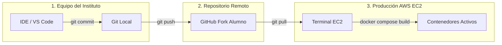

# Metodología de Trabajo: Flujo de Desarrollo y Actualización de Despliegues (CI/CD Manual)

**Módulo:** Despliegue de Aplicaciones Web (2º DAW)  
**Ciclo Formativo:** Desarrollo de Aplicaciones Web  
**Entorno de Proyecto:** Pizzería Bella Napoli (Multi-contenedor Docker + AWS EC2)

---

## 1. Fundamentos DevOps y Reglas de Oro

En entornos profesionales de desarrollo y operaciones (DevOps), **la infraestructura de producción (AWS EC2) es sagrada y descartable**:
- **Nunca se edita código directamente en el servidor:** No se utiliza `nano`, `vim` ni extensiones remotas sobre los ficheros en la instancia EC2 para alterar la lógica de negocio o los estilos.
- **Trazabilidad:** Todo cambio debe nacer en un entorno local controlado, ser versionado atómicamente con Git, pasar por GitHub y ser desplegado mediante imágenes inmutables de Docker.
- **Depuración local:** Si un cambio rompe la aplicación, debe romperse en tu equipo de clase, jamás en el servidor público en la nube.



---

## PASO 1: Desarrollo y Pruebas en el Entorno Local (Equipo del Aula)

Todo el trabajo diario de diseño, nuevos endpoints en la API o componentes de la interfaz se realiza en el ordenador del instituto.

### 1.1 Clonar tu Fork Personal (solo la primera vez)
Si todavía no tienes clonado tu repositorio en tu puesto del aula, clona **tu propio fork** (no el repositorio base del profesor):

```bash
git clone https://github.com/TU_USUARIO/pizzeria-base.git
cd pizzeria-base
```

### 1.2 Configurar variables de entorno y arrancar en modo desarrollo
Crea el archivo `.env` a partir de la plantilla y arranca los servicios locales:

```bash
cp .env.example .env
docker compose up -d
```

> **Nota:** El archivo `docker-compose.yml` estándar está optimizado para desarrollo local (con montajes de volúmenes reactivos para *hot-reloading*).

### 1.3 Implementar mejoras y verificar
Abre el proyecto con tu editor de código (por ejemplo, VS Code):
- Realiza los cambios solicitados (añadir pizzas a la carta, ajustar estilos CSS, modificar endpoints, etc.).
- Verifica en tu navegador local (`http://localhost`) que todo funciona sin errores de sintaxis ni fallos en consola.

### 1.4 Registrar los cambios en el control de versiones local
Comprueba el estado de los archivos modificados y genera un commit descriptivo:

```bash
git status
git add .
git commit -m "feat(web): actualizar carta de pizzas y nuevos precios"
```

---

## PASO 2: Sincronización con el Repositorio Central (GitHub)

Una vez probado y consolidado el commit en local, se publica en tu repositorio remoto:

```bash
git push origin main
```

> **Verificación obligatoria:** Entra en tu navegador a `https://github.com/TU_USUARIO/pizzeria-base` y comprueba que el nuevo commit aparece reflejado en la rama `main`. Si no está en GitHub, la instancia de AWS no podrá descargarlo.

---

## PASO 3: Despliegue en Producción (AWS EC2)

Con el código ya auditado y subido a GitHub, se traslada la nueva versión a la máquina en la nube.

### 3.1 Conexión a la Instancia EC2
1. Accede a la Consola de AWS EC2.
2. Localiza tu instancia `Pizzeria-TuNombre` y pulsa **Conectar** → **EC2 Instance Connect** (o mediante tu clave SSH si la tienes configurada).
3. Abre la terminal en el directorio del proyecto:
   ```bash
   cd ~/pizzeria-base
   ```

### 3.2 Descargar los cambios (Pull)
Descarga la última versión confirmada en GitHub:

```bash
git pull origin main
```

> **Alerta de Seguridad DevOps:** Si `git pull` genera un conflicto o error porque modificaste archivos manualmente en el servidor con `nano`, estarás violando el principio de inmutabilidad. En el servidor **nunca** debe haber cambios locales no versionados.

### 3.3 Reconstrucción y Despliegue de Contenedores
Dado que el código fuente está empaquetado dentro de las imágenes de Docker en el entorno de producción, **no basta con hacer `git pull`**. Es obligatorio indicar a Docker Compose que recompile las capas modificadas y recree únicamente los contenedores afectados:

```bash
docker compose -f docker-compose.prod.yml up -d --build
```

#### ¿Qué hace exactamente este comando?
- `--build`: Inspecciona los Dockerfiles y reconstruye las imágenes que tengan cambios en su contexto de archivos (`backend`, `frontend-web`, `frontend-qr-app`).
- `-d`: Mantiene los servicios ejecutándose en segundo plano (*detached mode*).
- **Cero pérdida de datos:** La base de datos PostgreSQL permanece intacta porque los datos residen en el volumen persistente `pizzeria_prod_pgdata`.

### 3.4 Verificación del despliegue
Comprueba que los contenedores se han recreado correctamente y están saludables:

```bash
docker compose -f docker-compose.prod.yml ps
```

Accede a tu URL pública segura (`https://daw-XX.guillermofoix.org` o a la IP directa de AWS) forzando el refresco de caché en el navegador (`Ctrl + F5` o `Cmd + Shift + R`) para verificar que las modificaciones ya están en producción.

---

## Tabla Resumen del Ciclo de Vida (Cheat Sheet)

| Fase | Dónde se ejecuta | Comandos clave | Propósito |
| :--- | :--- | :--- | :--- |
| **1. Desarrollo** | PC Aula (Local) | `docker compose up -d`<br>`git add .`<br>`git commit -m "..."` | Modificar código, probar sin riesgo y registrar cambios. |
| **2. Publicación** | PC Aula (Local) | `git push origin main` | Centralizar el código en GitHub. |
| **3. Despliegue** | Servidor AWS EC2 | `git pull origin main`<br>`docker compose -f docker-compose.prod.yml up -d --build` | Descargar nueva versión y recrear contenedores con imagen actualizada. |

---

## Preguntas Frecuentes y Diagnóstico de Errores

### ¿Por qué tras hacer `git pull` sigo viendo la versión anterior en la web?
Porque las imágenes de Docker de producción se compilaron con el código previo. Si no pasas el modificador `--build`, Docker Compose simplemente reutilizará la imagen antigua que ya tiene en caché local.

### ¿Qué hago si un cambio introducido rompe la API o la web en AWS?
1. Consulta los registros en tiempo real del contenedor que falla:
   ```bash
   docker compose -f docker-compose.prod.yml logs -f backend
   # o para el frontend:
   docker compose -f docker-compose.prod.yml logs -f frontend-web
   ```
2. Si requieres volver atrás de emergencia (*rollback* rápido), consulta el historial de commits y regresa al anterior:
   ```bash
   git log --oneline
   git checkout <HASH_COMMIT_ANTERIOR>
   docker compose -f docker-compose.prod.yml up -d --build
   ```
   *Nota: Posteriormente, soluciona el bug en tu entorno local y haz el push correspondiente a `main`.*
